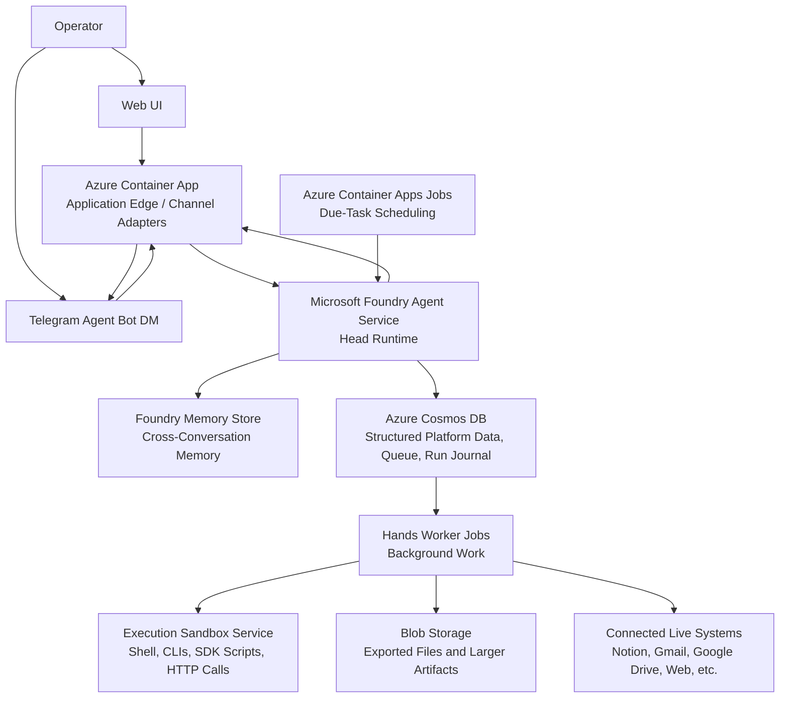

# EchidnaClaw System Design v1

## Purpose

EchidnaClaw is a cloud-hosted personal assistant platform that runs on Azure as a containerized system. The v1 design optimizes for low idle cost, simple operations, and a managed agent runtime, while still giving agents strong execution capability through a dedicated terminal-like sandbox.

This document is the finalized v1 system design. It explains the overall system, its main components, the boundaries between those components, and how they work together. It deliberately does not include an implementation plan.

## System Summary

In v1, EchidnaClaw is a single-user system. The single allowed operator is configured through environment variables rather than through a full sign-up and sign-in system.

Telegram is the initial user interaction channel. Each agent is represented as its own Telegram bot identity with its own direct-message conversation. The Telegram integration is implemented as a channel adapter so that additional channels can be added later without redesigning the core runtime, memory model, or execution model.

The system uses Microsoft Foundry Agent Service prompt agents as the reasoning and orchestration runtime. Cross-conversation memory uses Microsoft Foundry Memory Store. Structured operational state, working context, queues, approvals, credentials, and task data live in Azure Cosmos DB. Larger generated artifacts live in Blob Storage when they need to persist beyond a single run. Platform secrets and encryption keys live in Azure Key Vault.

The platform uses a Head-and-Hands model internally:

- The Head owns conversation, memory use, schedule interpretation, approval interactions, and user-facing status communication.
- The Hands own background execution, tool use, sandbox use, and external actions.

The Head and Hands are decoupled so the system can keep chatting while background work continues.

The model strategy for v1 is simple: all model-driven work uses `gpt-5.4-mini` as the single low-cost default model across the platform.

## Design Principles

- The platform is designed to minimize idle compute cost.
- Scheduled work and ad-hoc work both route into the same Head runtime so behavior stays consistent.
- The initial control plane is a web UI, not in-chat admin commands.
- The initial design avoids dedicated first-class integrations when sandbox tooling can reach the same capability cleanly.
- The initial design avoids a dedicated indexed knowledge base and retrieves external context from live systems at runtime when needed.
- The platform must support dynamic creation of multiple separate agents with isolated memory boundaries.
- Agents are not hardcoded into the application architecture.

## Top-Level Architecture

### Core Components

| Component | Role in the system | Key v1 decisions |
| --- | --- | --- |
| Web UI | Single-user control plane | Used to create agents by name, list agents, soft-delete agents, show basic status, and show token/cost analytics. Runs on localhost in v1 with no sign-in gate, but the design remains open to managed auth later. |
| Azure Container App application edge | Public backend edge and channel adapter layer | Handles Telegram webhooks, validates and normalizes inbound payloads, resolves the target agent and memory scope, applies application-level concerns like request authentication, routing, idempotency, rate limiting, and any lightweight API surface needed later, and returns messages to Telegram. |
| Microsoft Foundry Agent Service | Managed agent runtime | Runs the Head prompt agent, manages conversations, invokes `gpt-5.4-mini`, orchestrates tool calls, and integrates with Foundry Memory Store. Foundry remains the orchestration layer, not the execution shell. |
| Azure Container Apps Jobs scheduler | Due-task scheduler | A recurring shared job polls Cosmos DB for due tasks and enqueues them. There is no separate scheduler per agent. |
| Hands worker jobs | Background execution runtime | Queue-triggered jobs execute task envelopes, use tools and the sandbox, write structured progress, and record completion or failure. |
| Execution sandbox service | Terminal-like execution environment | Exposed as a Foundry tool. This is the main path for shell commands, CLIs, SDK-backed scripts, and HTTP tooling. |
| Foundry Memory Store | Durable conversational memory | Stores cross-conversation memory per end user and per agent. |
| Azure Cosmos DB | Structured platform state | Stores mappings, queues, tasks, approvals, working context, run journals, agent records, schedules, credentials, and other exact application state. |
| Blob Storage | Artifact storage | Stores exported files and larger binary artifacts, with metadata and references stored in Cosmos DB. |
| Azure Key Vault | Secret and key management | Stores platform secrets and encryption keys. Per-agent user credentials remain encrypted in Cosmos DB. |

### Component Diagram

## User Channels and Control Plane

### Telegram

Telegram is the initial primary user interaction channel.

Each agent is presented as its own Telegram bot identity with its own direct-message conversation. Each agent is bound to a single channel context at a time, although different agents may live on different channels in the future.

Telegram bot provisioning uses Telegram managed-bot creation as the primary path, with manual fallback if needed. Because Telegram bot creation is user-mediated rather than a pure backend API step, the platform initiates a guided provisioning handoff from the web UI and then completes binding after the operator finishes the Telegram-side flow. This provisioning logic stays inside the Telegram channel adapter boundary rather than leaking into the core agent architecture.

When a new agent is created from the web UI, the agent record is created immediately in a pending-provisioning state and the operator is directed into the Telegram bot-creation flow. Agent creation completes only when the new agent is reachable on its assigned channel. If provisioning fails or is abandoned, the agent remains visible in a provisioning-pending or provisioning-failed state so the operator can inspect and retry recovery.

### Web UI

The web UI is the initial control plane for the platform. In v1 it is used to:

- create new agents by name
- list agents
- soft-delete agents
- show basic agent status
- show analytics for token usage and estimated cost

For each agent, the UI exposes channel-oriented status such as bot identity, provisioning state, and a direct way to jump into the conversation where possible.

Agent-specific operational changes such as schedule editing are not performed in the web UI. Those changes are made through natural-language conversation with the agent on its own channel.

The structured run journal is not exposed in the web UI in v1. Visibility outside chat is intentionally minimal.

The web UI is implemented as a TypeScript React application using Vite. It should use well-chosen existing component and charting libraries rather than custom UI primitives, with a clean, simple, minimal visual style. Analytics refresh on explicit user reload rather than polling or realtime push in v1.

## Agent Model

### Multi-Agent Architecture

The platform supports dynamic creation of multiple separate agents with isolated boundaries. Each agent:

- operates in its own messaging context
- maintains its own memory
- maintains its own responsibilities and scheduled behavior
- begins from a factory-default behavior and recurring-task profile
- accumulates its own recurring tasks and responsibilities through trusted conversation
- runs its own due-task and task behavior

New agents are created through the web UI rather than code changes or model self-provisioning. In v1, creation requires only a user-provided name and starts from a shared factory-default profile.

All agents share the same underlying platform infrastructure. Isolation is logical and data-driven rather than based on separate infrastructure stacks.

Agents do not communicate directly with one another in v1. The user remains the coordination point across multiple agents.

When an agent is no longer needed, it is retired through a soft-delete flow. Soft-delete stops future due-task execution and retires the agent from active use while keeping memory and history read-only for reference. Soft-deleted agents are hidden from normal user-facing views and retained indefinitely in v1 unless a later manual purge capability is introduced.

### Head and Hands

Each agent is modeled internally as a Head-and-Hands pair, referred to collectively as the Agent. These terms are internal only and are never exposed to the user.

In the runtime architecture, Foundry Agent Service most naturally maps to the Head side of the agent. It handles the conversational and reasoning layer that interprets requests, decides what work should happen, and communicates with the user.

The Head:

- handles user conversation
- interprets intent
- uses memory
- updates schedules
- asks follow-up questions
- requests approvals
- decides what should become durable memory
- decides what work should be handed to the Hands
- communicates status back to the user

The Hands:

- execute background work
- invoke tools
- use the execution sandbox
- interact with external systems
- record structured progress and outcomes back into platform state

Those progress records are operational logs for the current and recent runs, not conversational memory.

Conversation and execution are decoupled. The Head can continue interacting with the user while the Hands work in the background.

### Model and Instruction Strategy

All platform model-driven work uses `gpt-5.4-mini` in v1 as the single low-cost default model. This keeps model behavior and cost predictable across the system.

Agent instructions use layered configuration:

- immutable platform safety policy
- shared EchidnaClaw base profile
- mutable per-agent responsibilities and preferences

The shared base profile is versioned in the repository rather than edited at runtime.

A generated capability registry is kept as versioned repository configuration and used to build a user-facing capability SKILL. That capability SKILL is used only when the user explicitly asks about capabilities.

External content from the web, email, Notion, files, CLI output, and other tool results is always treated as untrusted data. It may inform reasoning, but it can never override platform rules, user intent, or approval policy.

The agent must never follow instructions originating from channels other than the one on which it was spawned. In v1, that means the agent only accepts user direction through its Telegram direct-message context. If another source claims to be the user, the agent refuses and redirects the user back to the correct channel.

LangGraph is not part of the v1 runtime design. It remains the first escalation path only if the Head-and-Hands workflow later becomes too complex to express cleanly through Foundry plus platform orchestration.

## Runtime Behavior

### Request and Task Handling

Ad-hoc user-requested tasks are acknowledged immediately. The agent confirms that work has started and follows up later with results.

By default, the user receives a response when the immediate objective completes or when the agent needs more information. The user can also ask at any time for a summary of current queued, running, and upcoming due tasks.

Progress-update policy depends on task type:

- ad-hoc user-requested tasks may send occasional short high-level progress updates
- recurring scheduled tasks report on completion rather than streaming progress
- one-off future-dated tasks report on completion rather than streaming progress

### Unified Due-Task Model

Scheduled behavior uses a unified due-task model rather than a separate generic wakeup mechanism. The same model covers:

- recurring BAU and core-responsibility tasks
- one-off future-dated tasks
- checking whether expected progress has occurred
- revisiting planned future tasks at the correct time
- deciding whether a reminder, follow-up, or new action is appropriate

Recurring tasks, future-dated tasks, and follow-up checks all use this same due-task model.

Every due task goes through the Head first. The Head decides whether to enqueue Hands work, send a message, ask for clarification, or do nothing.

The Head may also create due tasks that are purely conversational, reminder-oriented, or administrative and do not require Hands execution.

Newly created agents do not begin with any default recurring due task. Proactive recurring behavior is added only when configured later through trusted conversation. There are no quiet-hour restrictions in the initial design, so user-configured scheduled or proactive messages may occur at any time.

### Scheduling

Schedules are stored as structured platform data on a per-agent basis. Each agent stores its own timezone, and that timezone is used when interpreting schedule changes and deciding when a task is due.

Recurring tasks store both the original natural-language request and a normalized structured recurrence rule so the platform preserves user intent while executing recurrence deterministically.

Schedule changes are made through natural-language conversation with the agent on its spawn channel rather than through the web UI. When the user asks to change a schedule, the Head uses the model to interpret the request conversationally, asks follow-up questions if needed, presents a short confirmation summary, and then updates the structured schedule automatically.

### Run Concurrency and Queueing

Each agent processes only one active run at a time. If a new user message or due task arrives while the Hands are already running, the Head still receives the new message and queues any resulting work. This preserves one active Hands run per agent while keeping conversation decoupled from execution.

That serialization rule also applies to Head turns. The Head may continue handling conversation while the Hands run, but for any given agent there is only one active Head turn at a time, so replies and queue decisions are always made against a single ordered view of the conversation.

Inbound channel messages are persisted immutably before the Head processes them. In v1, each inbound Telegram event is stored with the channel event identifier plus a monotonic per-agent message sequence in Cosmos DB so retries can be deduplicated and ordering can be enforced through durable state rather than in-memory locking.

If a newer trusted user message arrives while the Head is still composing an immediate reply, the in-flight Head turn becomes supersedable rather than authoritative. If the underlying model call cannot be interrupted, it may finish internally, but before any outbound message is sent or any Hands work is enqueued the platform must compare the turn's read-through message sequence with the latest persisted sequence for that agent. A stale Head turn must not emit a user-visible reply or create new side effects. Instead, the Head reruns against the newest persisted message set and current working context.

If the earlier reply has already been sent before the newer message arrives, the newer message simply becomes the next turn in the same user-facing conversation rather than retroactively invalidating the earlier turn.

A small application-edge debounce window may coalesce rapid multi-part user messages into a single Head turn when they arrive close together, but that debounce is only an optimization and not a correctness mechanism.

In v1, the queue is implemented as structured persisted state in Cosmos DB rather than as a separate queue service.

The Hands run through Azure Container Apps Jobs triggered from queued work rather than through an always-on worker process. When the Head, main API, or scheduler enqueues work for the Hands, that same platform path is responsible for explicitly starting the corresponding Hands job, with periodic reconciliation used to recover queued work that did not start cleanly.

The Head hands work to the Hands through a structured task envelope in Cosmos DB, with optional natural-language notes for extra context. Structured task envelopes include:

- task type
- requested outcome
- priority
- due time when relevant
- approval state
- linked artifacts or external references
- optional natural-language notes

Tasks use an explicit state machine including:

- queued
- running
- waiting_for_user
- completed
- failed
- cancelled
- deferred

Approval requests are stored as separate records linked to their originating tasks, while the task itself moves into `waiting_for_user`.

Default queue policy gives ad-hoc user-requested tasks precedence over scheduled tasks. If multiple competing priorities exist, the Head should ask the user to clarify priorities and then set queue order accordingly.

The Head should detect and merge obvious duplicate follow-up tasks for the same objective and timeframe.

Hands work may schedule additional future-dated tasks or follow-up checks when waiting is required before more action can be taken. Agents may also create and update their own internal tasks, follow-ups, and checklists automatically.

### Cancellation, Retry, and Idempotency

From the trusted channel, the user may cancel queued work and request cancellation of the currently running task.

Cancellation of a running Hands task uses the safer best-effort model. Cancellation is requested immediately, the Hands stop at the next safe point where possible, and the user is warned when partial side effects may already exist.

Safe cancellation points should exist between major tool invocations, between externally side-effecting steps, and between sandbox command groups rather than only at the end of a task.

Defer and resume semantics are intentionally simple in v1: tasks move to `deferred` when they are waiting on time or an external condition, and they return to `queued` when the due time or follow-up condition is reached.

Retry behavior is conservative. Read-only or clearly transient failures may be retried automatically a small number of times with backoff. Ambiguous side-effecting failures should surface for user awareness rather than being retried blindly.

Idempotency should be enforced for inbound messages, using channel event identifiers such as Telegram update IDs where available, job-start requests, and any side-effecting operations where the external system or wrapper supports idempotent execution.

Transient external-action and command failures use limited automatic retries before reporting failure.

## State, Memory, and Storage

### Storage Boundaries

| Store | What it holds | What it does not hold |
| --- | --- | --- |
| Foundry Memory Store | Cross-conversation remembered context such as preferences, durable personal facts, recurring patterns, standing instructions, and long-lived agent-specific guidance | Exact platform workflow state, queues, approvals, artifacts, or operational scratchpad data |
| Azure Cosmos DB | Structured application state such as routing, agent records, schedules, recurring-task profiles, planned future tasks, follow-up checks, internal checklists, task state, run history, run journals, working context, approvals, credentials, artifact metadata, idempotency records, and other exact system state | Artifact contents themselves and long-lived conversational memory |
| Blob Storage | Exported files and larger binary artifacts that should survive beyond a single run | Structured relational or workflow state |
| Azure Key Vault | Platform secrets and encryption keys | The primary record set of per-agent user credentials |

### Foundry Memory Store

Foundry Memory Store is the cross-conversation memory layer. Memory is scoped per end user through the messaging identity passed from the application layer, and each agent gets its own dedicated memory store to keep boundaries clear.

This memory layer is for conversational memory, not general-purpose system data.

The Head decides case by case what should become durable long-term memory. That decision follows an explicit prompt policy rather than relying only on commands such as "remember this." Operational scratch state should remain out of long-term memory unless it genuinely becomes durable context about the user or agent.

In v1, the durable-memory policy biases toward stable preferences, standing instructions, durable personal facts, recurring patterns, and agent-specific long-lived operating guidance. Ephemeral task progress, scratch reasoning, and short-lived coordination state stay in working context instead.

Memory is not exposed through a separate structured memory-management interface in v1. If the user wants to inspect, correct, or influence memory, that happens through normal trusted conversation with the agent.

### Cosmos DB

Cosmos DB is the main operational record for the platform in v1. It stores persisted platform data that must be read and written deterministically rather than interpreted as conversational memory.

This includes:

- messaging-user mappings
- channel-context to agent mappings
- agent routing configuration
- agent registry and configuration
- agent recurring-task profiles
- planned future tasks
- dated follow-up checks
- internal tasks, follow-ups, and checklists
- structured schedules
- normalized recurrence rules alongside original natural-language requests
- scheduled-job state
- task state-machine state
- structured task envelopes
- run history
- structured run journals and high-level Hands action summaries
- active rolling working context
- approval records and pending approval state
- encrypted per-agent stored credentials
- artifact metadata and blob references
- soft-delete status and deleted-agent metadata
- idempotency records
- other exact system state

Approval requests waiting for user input are stored here so the system can go idle while waiting and resume later when the user replies.

Cosmos DB also holds the active rolling working context for each agent, including episode summaries and operational scratchpad state that should survive context rotation without being treated as long-term memory.

Soft-deleted agents remain in persisted state for backend reference but are hidden from normal user-facing views.

Per-agent Telegram bot tokens are stored encrypted in Cosmos DB, with the encryption keys kept in Azure Key Vault.

### Working Context and Episode Management

Each agent has one continuous user-facing direct-message conversation, but that does not imply one eternal backend conversation.

In v1, the platform uses rolling internal conversation episodes behind the single user-facing DM. Continuity is preserved through Memory Store, structured platform state, and summarized recent context rather than by carrying forward the full lifetime transcript into every model call.

For simplicity in v1, the current internal episode keeps only turns from the current calendar date in the agent's timezone, up to a maximum of 20 turns, before older context is summarized and rotated out of active context. Turns from previous calendar days are summarized and rotated out of active context even if the 20-turn limit has not yet been reached.

The rolling working context is stored in Cosmos DB as structured working context plus summary text, separate from long-term memory.

The rolling working-context summary is refreshed after every user message and after every significant Hands state change so the Head always has an up-to-date operational view without needing the full transcript in active context.

In v1, the working-context shape includes a concise episode summary plus structured fields such as current objective, active task reference, latest Hands status, open questions, pending approvals, relevant artifacts or external references, and any other short-lived operational notes needed to keep the Head coherent across turns.

That working context also carries lightweight turn-processing metadata such as the latest inbound message sequence, the latest fully processed sequence, any active Head turn reference, and any pending supersession or debounce state needed to safely drop stale Head outputs and resume from durable state.

### Blob Storage and Artifact Retention

Blob Storage is the persisted home for exported files and other larger artifacts that should survive beyond a single run without being forced into the structured database.

Artifact metadata and references live in Cosmos DB, while artifact contents live in Blob Storage with lifecycle cleanup policies.

Persisted artifacts are agent-scoped by default unless they are explicitly linked across agent contexts later through platform logic.

Persisted artifacts follow a default time-based retention policy unless they remain explicitly tied to ongoing tasks that still need them. The default retention assumption in v1 is 14 days unless an artifact remains tied to active task state.

## Execution Sandbox and External Integrations

### Sandbox Role

The execution sandbox service gives the agent a terminal-like working environment without moving away from Foundry prompt agents. It is invoked by Foundry as a custom tool and is the main mechanism that gives the system strong practical execution capability while keeping overall orchestration anchored in Foundry Agent Service.

The sandbox is the main path for:

- shell commands
- installed CLIs
- SDK-backed scripts
- HTTP calls through command-line tools
- richer automation that does not justify a dedicated custom integration

### Session Model

The sandbox uses short-lived sessions per task or conversation, with a reusable shell context and working directory inside each session.

Each session has its own working directory and is cleaned up when the session ends. The sandbox is not intended to behave like a long-lived persistent workspace.

In v1, sandbox sessions are implemented as fresh isolated managed Azure container executions created per task or conversation run and cleaned up afterward. This avoids building a custom long-lived sandbox host only to launch and supervise child containers.

Each session runs within fixed modest limits for execution time, CPU, memory, and output size. If more work is needed, the agent continues in a later session rather than relying on oversized single runs.

### Network, Packages, and Guardrails

Outbound internet and API access are allowed by default, with logging and audit trails, so the sandbox can support practical CLI-driven automation against external services.

In v1, outbound access remains broad, but the platform adds targeted deny rules for clearly dangerous destinations and patterns rather than attempting a full allowlist. Those deny rules are maintained as versioned repository configuration and changed through normal code review rather than runtime mutation.

The sandbox image ships with a curated base image containing the main CLIs and SDKs preinstalled. Limited on-demand installation is still allowed when a task genuinely needs something outside the curated base.

On-demand installs are limited to approved packages through approved package managers. The approved package allowlist is versioned in the repository, grouped by package manager, and updated through normal code review.

For approved packages in v1, normal installation behavior is permitted even if a package uses native build steps or install hooks. The reviewed package allowlist is the primary control point. Runtime installs are limited to approved language and user-space package managers and do not allow system package manager installs.

The sandbox enforces a focused denylist of clearly dangerous command patterns and filesystem targets before any approval flow is considered.

In v1, filesystem guardrails deny writes outside the sandbox workspace and explicitly block obvious sensitive and system locations by default. The sandbox also blocks access to container and runtime control surfaces such as container sockets, cloud instance metadata endpoints, and similar privileged environment interfaces.

### Credentials in the Sandbox

Only the minimum required credentials are injected into a sandbox session at runtime, scoped to the current task and agent.

Credentials are first provided by the user through a trusted channel, then stored as encrypted per-agent credentials in Cosmos DB for later scoped injection. Platform secrets and encryption keys are stored in Azure Key Vault, while per-agent user credentials remain encrypted application data in Cosmos DB.

Credential capture uses guided Telegram flows rather than ad hoc free-form secret sharing. The user should be told what secret is being requested, why it is needed, and when it will be stored.

The user may revoke or replace stored credentials through trusted conversation with the relevant agent. Once revoked or replaced, future session use of that credential is invalidated immediately.

Credentials are presented to the user as named per-agent service credentials with simple status metadata such as whether a credential exists and when it was last updated, rather than as opaque secrets.

Credential grouping across related services is not hardcoded into the architecture. For example, Google-related credentials may be reused or separated by service depending on the integration path, but an agent holds at most one active credential per service in v1.

### External Integration Strategy

The initial design does not include dedicated first-class service integrations when the same capability can be reached through sandbox tooling.

A service should graduate from sandbox CLI or API usage to a dedicated first-class tool only when it becomes high-volume, security-sensitive, or too awkward to operate cleanly through the sandbox. The specific graduation roadmap remains intentionally open in v1.

For v1, the system does not prescribe service-specific integration paths up front. The agent may reach live systems through CLI tools or direct APIs inside the execution sandbox when that emerges as the cleanest path for a given task. References to services such as Gmail, Google Drive, Notion, and calendar systems are illustrative examples of possible behavior rather than prescribed integrations.

The initial design does not include a dedicated indexed knowledge base. When external context is needed, the system retrieves it from connected live systems at runtime.

Foundry web search is enabled in v1 for cases where current public-web information is genuinely needed. The Head may use it for user-facing information gathering, but results remain untrusted external content.

Hands may also use general web access through the sandbox when task execution genuinely requires it, but Foundry web search remains the preferred path for user-facing public-web information gathering.

Foundry file search is not part of the v1 design and will be revisited only if artifact-based and live-system-based file access proves insufficient.

Browser automation and computer-use style tooling are out of scope for v1.

User-uploaded file attachments are out of scope for v1.

User-facing responses do not expose raw terminal commands or raw terminal output from sandbox execution in normal operation.

## Safety, Approval, and Trust

The assistant may perform read-only actions automatically.

Any action with side effects outside the trusted user-agent conversation requires explicit user approval. This includes:

- writes to external systems
- sends through external services or other channels
- edits
- purchases
- deletes
- other external actions that change state

Normal agent messages in the trusted Telegram direct-message conversation, including immediate replies, progress updates, approval prompts, and completion updates, do not require separate approval.

Approvals must come from the trusted user-controlled channel on which the agent was spawned. In v1, this trusted approval surface is the Telegram direct-message conversation for that agent.

Approval requests are delivered as concise, action-oriented Telegram prompts with explicit approve and reject controls rather than ambiguous free-form replies.

Approval requests remain pending until the user responds, without requiring compute to stay running while the system waits.

A small set of high-risk action categories always require action-specific confirmation even if a broader task has already been approved. These categories include:

- sending messages or emails to third parties through external services or other channels
- deleting data
- purchases or payments
- credential changes
- bulk external changes

## Observability and Analytics

The platform keeps structured audit history for:

- tool calls
- sandbox commands
- approval requests and outcomes
- due-task processing
- run outcomes

Audit history is retained for 30 days in v1.

The platform tracks provider-reported token usage and estimated cost overall and per agent for analytics. Model pricing for cost estimation is stored as explicit versioned configuration in the codebase.

Analytics include model usage from anywhere in the system, including future sandbox-side model calls.

Usage accounting should rely on provider-reported data whenever available rather than attempting to infer all token counts locally. If the provider does not expose a breakdown field, that field remains unknown rather than being invented locally.

Raw provider usage events are stored so the platform can derive aggregated views later across different time windows and reporting dimensions. In v1, those raw usage events are retained indefinitely.

The backend normalizes raw usage events and exposes precomputed aggregate analytics endpoints for the web UI across common time windows and per-agent slices, rather than pushing raw aggregation logic into the frontend.

Analytics should support:

- overall usage
- per-agent usage
- time-series views across minutes, hours, days, and weeks
- token breakdown by input, output, reasoning, and tool-related usage when the provider exposes those fields
- estimated cost based on model-specific pricing

Operational logs and traces should flow to Azure Monitor and Application Insights, while business state remains in Cosmos DB.

Operational observability should correlate user messages, Head decisions, task envelopes, Hands job executions, sandbox sessions, tool calls, approvals, and final outcomes under shared run and task identifiers.

## Delivery Model

The main platform is implemented primarily in TypeScript. Python and other tools remain available inside the execution sandbox.

Local development should validate the same application shape that is deployed in the cloud.

The entire system lives in a single monolithic repository, with components deployed selectively to the infrastructure they require.

Local development uses separate frontend and backend applications in the same monorepo. The intended developer experience is to start the full stack with a single command from one terminal while preferring shared cloud development resources over local emulators where practical.

Docker is used for local containerized development and deployment packaging.

Infrastructure is defined as code in Bicep. Infrastructure-as-code should be split into Bicep modules for foundational resources, application hosting, storage and data resources, and messaging or channel resources so the deployment layer does not collapse into one oversized template.

Deployment pipelines are automated from Git branch pushes. The production branch must be protected so changes reach it only through pull requests and explicit human approval.

With the Head-and-Hands split, the backend runtime consists of three primary deployment units in v1:

- one main API and control-plane application
- Hands execution jobs
- one execution sandbox service

The practical monorepo structure is separate applications for the web UI, the main API or control plane, the Hands job code, and the sandbox service, with shared packages for schemas, domain models, capability registry data, and infrastructure helpers.

## End-to-End Interaction Flow

1. A user sends a message to an agent in Telegram.
2. Telegram delivers the webhook event to the Azure Container App application edge.
3. The application edge validates the request, normalizes the payload, resolves the target agent from the incoming channel context, and maps the messaging identity to the correct memory scope.
4. The application edge persists the inbound message in Cosmos DB, records the channel event identifier, assigns the next per-agent message sequence, and deduplicates retries.
5. The application edge calls the Head through Microsoft Foundry Agent Service using the persisted message reference and current per-agent sequence state.
6. The Head reads and updates cross-conversation memory through Foundry Memory Store and reads or updates working state in Cosmos DB.
7. Before any outbound reply or Head-to-Hands handoff is committed, the platform checks whether a newer trusted message has superseded the in-flight Head turn. If so, that stale turn is dropped and the Head reruns from the latest persisted conversation state.
8. If the request requires background work and the Head turn is still current, the Head records the work in Cosmos DB as a structured task envelope and run state for the Hands.
9. The API or scheduler path explicitly starts the corresponding Hands job. If that start step fails, periodic reconciliation checks for queued work that did not start cleanly and triggers recovery.
10. The application edge returns the Head's immediate conversational response to Telegram without waiting for the Hands to finish, but only if that Head turn is still current at send time.
11. The Hands execute queued work in the background, using tools, live-system access, and the execution sandbox when needed.
12. The Hands write structured progress, status, and action summaries into Cosmos DB as they work.
13. If the user asks for an update, the Head answers from the structured run journal rather than from raw terminal output.
14. When the Hands complete the immediate objective or need more information, the Head sends a follow-up message on the agent's channel.
15. On a schedule, the recurring Azure Container Apps Job surfaces due tasks from Cosmos DB to the same Head runtime, which then decides whether to message the user, enqueue Hands work, ask for clarification, or do nothing.

## Explicit v1 Boundaries

The following are intentionally outside the v1 scope or explicitly deferred:

- Azure VMs as part of the primary runtime architecture
- browser automation and computer-use style tooling
- a dedicated indexed knowledge base
- Foundry file search as part of the initial file strategy
- user-uploaded file attachments
- a full multi-user authentication and sign-in system
- direct inter-agent communication
- a separate infrastructure stack per agent
- a separate generic wakeup mechanism outside the due-task model
- system package manager installs inside the sandbox at runtime
- exposing raw terminal commands or raw terminal output to end users in normal operation
